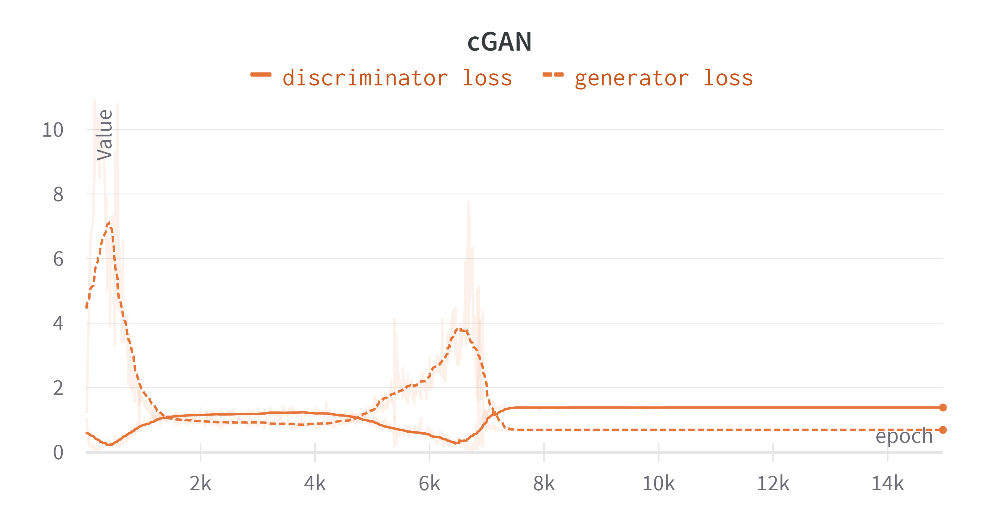
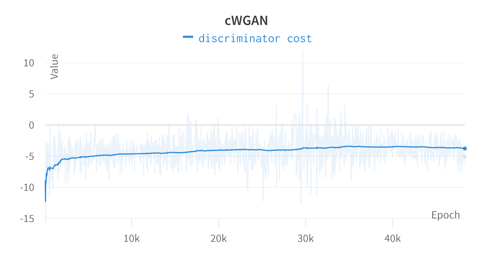
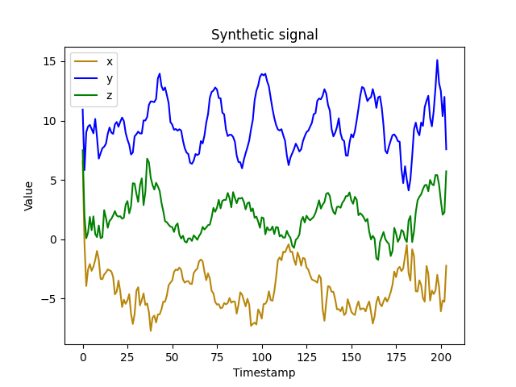

# Accelerometer Signal Generation using cWGANs and cGANs.

## Description
This repository is linked to the paper _Data augmentation for Human Activity Recognition with Generative Adversarial Networks_, submitted to Journal of Biomedical and Health Informatics and authored by M. Lupión[^1], F. Cruciani[^2], I. Cleland[^2], C. Nugent[^2] and P. M. Ortigosa[^1].

[^1]: Department of Informatics, University of Almerı́a, CEiA3, Sacramento Road, Almerı́a, 04120, Spain.
[^2]: School of Computing, Ulster University, 2-24 York Street, Belfast, United Kingdom. 

In this work, Human Activity Recognition accelerometry data is synthetically generated using _cWGANs_ and _cGANs_.

## Installation

In order to build the project, the user has to install *Python* and run the command:
```
pip install -r requirements.txt
```

## Code Structure
 - _train.py_: Contains the code to train a _cGAN_ or _cWGAN_. 
 - _inference.py_: Contains the code to generate synthetic acclerometry signals from a trained generator. 
 - _models.py_: Contains some generator and discriminator architectures to generate synthetic accelerometry signals. 
 - _.env_: Contains the environment variables that define the training and inference executions. 

## Execution instructions

### Training

The user can customize the environment variables to adjust the synthetic data properties. These variables must be the same in training and inference mode. These are:
- WINDOW_SIZE. Default = 204. Defines the number of time samples that a window of time will have. 
- NUM_VARIABLES. Default = 3. Defines the number of coordinates of the signal. 
- NOISE_DIM. Default = 128. Defines the size of the input noise of the CGAN.
- NUM_CLASSES. Default = 20. Defines the number of classes in the dataset.
- CGAN. Default = False. Defines the type of *cGAN*. If *False*, it is a *cWGAN*. If *True*, it is a *cGAN*.


Once the variables are set, the user has to run the following command:
```
python train.py
```

### Inference
The user can generate synthetic signals using the following command:
```
python inference.py <number of samples>
```

## Results

In this work, *cGAN* and *cWGAN* were trained until the training was stabilized. Figures below show the training evolution of both approaches. It is important to remark that *cGAN* produced a model collapse. 



 
A sample of a  synthetic accelerometry signal involving the activity **walk** is the following:


In the paper, a comparison between *cGAN* and *cWGAN* was performed. Results show that *cWGAN* outperforms *cGAN* in terms of visual quality and metrics such as 1-kNN, Inception Score and Kernel MMD. 

In the work, in order to define the generator architecture, several Autoencoders were built. The decoder of the AE having the best reconstruction capabilities of the signal was selected to be the generator architecture. Results are shown in [Autoencoder Training Results](autoencoder_results.md)

## License
This software is provided 'as is', with the best intention but without any kind of warranty and responsibility of stability or correctness. It can be freely used, distributed and modified by anyone interested, but a reference to this source is required.

## Citing
For citing this software, please, cite the associated paper as follows: M. Lupión, F. Cruciani, I. Cleland, C. Nugent and P. M. Ortigosa. Data augmentation for Human Activity Recognition with Generative Adversarial Networks. _Journal of Biomedical and Health Informatics_, 2024.

## Contact
For any question or suggestion feel free to contact:

- Marcos Lupión: [marcoslupion@ual.es](marcoslupion@ual.es)